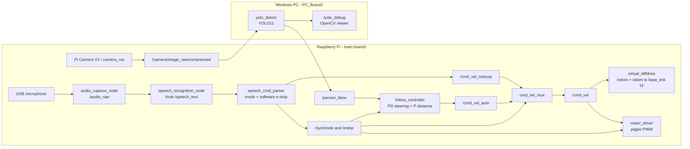

# ROS 2 Voice-Controlled Follow-Me Rover

A modular, experimental differential-drive rover built around a Raspberry Pi 4 and ROS 2. It implements offline voice commands, a split Pi/Windows computer-vision pipeline, and the software needed to drive and follow a detected person. Development concluded during physical follow-controller tuning, so this repository documents a working architecture and prototype rather than a floor-ready autonomous robot.

[View the portfolio project page](https://gabriel-twiggho.github.io/#ai-robot)

The code is split deliberately across two branches:

| Branch | Machine | Purpose |
| --- | --- | --- |
| [`main`](https://github.com/Gabriel-Twiggho/ros2-rover/tree/main) | Raspberry Pi | Audio capture, offline speech recognition, command/state handling, velocity routing, simulation, motor control, and follow controller |
| [`PC_Branch`](https://github.com/Gabriel-Twiggho/ros2-rover/tree/PC_Branch) | Windows PC | YOLO11 person detection, debug image viewer, and Windows launch scripts |

> **Safety notice:** this is an experimental physical robot. Test with the wheels raised, a clear stop procedure, and motor power that can be disconnected independently. The repository implements a *software* e-stop; it is not a replacement for a hardware emergency stop or responsible supervision.

## Project outcome

The project reached Phase H before development concluded. The physical rover, ROS 2 workspaces, speech pipeline, cross-device vision pipeline, simulation, motor driver, velocity multiplexer, and follow-controller code were built. Reliable real-world turning and person-following still required substantial PID/PD tuning.

| Area | Outcome |
| --- | --- |
| Raspberry Pi platform | ROS 2 Iron built from source on Raspberry Pi OS Bookworm; camera topic verified |
| Speech interface | Offline Vosk speech recognition and command parsing implemented |
| Simulation | Voice-to-motion path, virtual differential drive, odometry, TF, and RViz workflow implemented |
| PC vision | YOLO person detection, debug viewer, and `/person_bbox` exchange implemented on `PC_Branch` |
| Hardware and motion | Physical rover, Cytron motor-driver node, velocity mux, and follow controller reached integration/tuning |
| Physical follow mode | Not tuned to repeatable, reliable real-world behaviour before the project concluded |
| Phase I safety/autonomy | Floor-safety and obstacle-system validation not completed |
| Phase J intelligence | LLM/LLAVA integration, context-aware person selection, and named-location navigation not implemented |

The remaining work required repeated physical testing and controller tuning. Development ended when the available project time shifted to other volunteer commitments. The unfinished scope is recorded here so the repository does not overstate what was demonstrated.

## Implemented capabilities

- Captures microphone audio on the Raspberry Pi and publishes it on ROS 2.
- Runs offline speech-to-text with Vosk, then parses commands such as motion, `follow me`, `manual`, `stop`, and `resume`.
- Uses a mode-aware velocity multiplexer so manual and autonomous commands do not both control the drivetrain.
- Simulates differential-drive motion with odometry and TF for RViz testing.
- Drives two DC motors through a Cytron MDD3A using `pigpio` PWM on the Pi.
- Streams the Pi camera to a Windows PC, where YOLO11 detects people.
- Sends the largest detected person's normalised bounding box back to the Pi for a smoothed PD/P follow controller.

## System architecture



### Follow-me data contract

`yolo_detect` publishes `/person_bbox` as a `std_msgs/Float32MultiArray`:

```text
[normalised_center_x, normalised_center_y, normalised_area, confidence]
```

The Pi-side controller ignores low-confidence results, smooths the centre and area using an EMA, applies PD control for steering and P control for following distance, limits acceleration, and stops when detections time out. It only outputs motion in `FOLLOW` mode and when the e-stop is clear.

## Hardware and software

The current build has been developed around:

- Raspberry Pi 4B (8 GB) with a Fan SHIM
- Raspberry Pi Camera Module V2
- USB microphone and USB speaker
- Two geared DC motors in a differential-drive chassis, rear caster, and 3D-printed wheels/frame
- Cytron MDD3A dual motor driver
- Windows PC with an NVIDIA-capable GPU for YOLO inference
- Raspberry Pi OS Bookworm with ROS 2 Iron built from source on the Pi
- ROS 2 Iron on Windows with a separate Python 3.8 virtual environment for the YOLO node

The project uses the same ROS 2 DDS domain on both machines. The committed Windows scripts set `ROS_DOMAIN_ID=42`; set the Pi to the same value, or change both sides to a domain appropriate for your network.

## Repository layout

```text
main (Raspberry Pi)
|- scripts/                     # Pi launch helpers
`- src/
   |- audio_capture_node/       # sounddevice microphone to /audio_raw
   |- speech_recognition_node/  # Vosk to /speech_text
   |- speech_cmd_parser/        # voice commands, mode, e-stop
   |- cmd_vel_mux/              # mode-aware manual/autonomous arbitration
   |- follow_controller/        # /person_bbox to /cmd_vel_auto
   |- motor_driver/             # /cmd_vel to Pi GPIO PWM
   `- virtual_diffdrive/        # /cmd_vel to odometry + TF

PC_Branch (Windows)
|- scripts/                      # PowerShell wrappers for YOLO/debug viewing
`- src/yolo_detect/              # compressed camera image to YOLO11 results
```

## Getting started

This repository reflects a hardware-specific development workspace, rather than a one-command installer. The existing scripts assume these paths:

- Pi workspace: `~/ros2_iron`
- Windows ROS installation: `C:\dev\ros2_iron`
- Windows workspace: `C:\dev\ros2_ws`

Adjust the script and launch-file paths if your workspace differs.

### 1. Prepare the Pi (`main`)

Install/build ROS 2 Iron and `camera_ros` in the Pi workspace first. Create and activate a Python virtual environment containing the runtime Python packages used by the Pi nodes:

```bash
python3 -m venv ~/ros2_venv
source ~/ros2_venv/bin/activate
python -m pip install --upgrade pip
python -m pip install sounddevice numpy vosk word2number pigpio
```

Install and enable `pigpiod` before using the hardware motor driver. Download a compatible Vosk English model and place it at:

```text
~/models/vosk-model-small-en-us-0.15
```

Build the custom packages in the ROS workspace, then source the result:

```bash
cd ~/ros2_iron
colcon build --packages-select \
  audio_capture_node speech_recognition_node speech_cmd_parser \
  cmd_vel_mux follow_controller motor_driver virtual_diffdrive
source install/setup.bash
```

### 2. Prepare the PC (`PC_Branch`)

The PC branch includes a more detailed [`yolo_detect` setup guide](https://github.com/Gabriel-Twiggho/ros2-rover/blob/PC_Branch/src/yolo_detect/README.md). In short, install ROS 2 Iron, create a Python 3.8 virtual environment, then install Ultralytics, OpenCV, NumPy, and a CPU or CUDA-enabled PyTorch build.

```powershell
py -3.8 -m venv "$env:USERPROFILE\ros2venv"
& "$env:USERPROFILE\ros2venv\Scripts\Activate.ps1"
python -m pip install --upgrade pip
pip install ultralytics opencv-python numpy
# Install the PyTorch build appropriate for this PC/GPU.
```

Build the Windows workspace after placing the `PC_Branch` files in `C:\dev\ros2_ws`:

```powershell
. "C:\dev\ros2_iron\local_setup.ps1"
cd C:\dev\ros2_ws
colcon build --packages-select yolo_detect
. "C:\dev\ros2_ws\install\local_setup.ps1"
```

### 3. Start the system

On the Pi, run the camera, audio, speech, command parser, velocity mux, and either simulation **or** motor driver. The individual scripts in `scripts/` are the clearest way to bring up and inspect each component during development.

```bash
cd ~/ros2_iron
bash scripts/run_camera.sh
bash scripts/run_audio_capture.sh
bash scripts/run_speech_recognition.sh
bash scripts/run_speech_cmd_parser.sh
bash scripts/run_cmd_vel_mux.sh
bash scripts/run_follow_controller.sh
```

For a safe simulation path, start the virtual drivetrain:

```bash
bash scripts/run_virtual_diffdrive.sh
rviz2 -d src/speech_cmd_parser/rviz/sim_odom_tf.rviz
```

For physical motor tests, use the motor driver **instead of relying on simulation alone**, after completing the safety checks above:

```bash
bash scripts/run_motor_driver.sh
```

On the PC, start YOLO detection using the provided PowerShell wrapper:

```powershell
. "C:\dev\ros2_ws\scripts\run_yolo_detect.ps1"
```

To see the annotated camera feed:

```powershell
. "C:\dev\ros2_ws\scripts\run_debug_viewer.ps1"
```

Useful checks:

```bash
# Pi
ros2 topic echo /speech_text
ros2 topic echo /sys/mode
```

```powershell
# PC
ros2 topic echo /person_bbox
ros2 topic hz /detections
```

> The Pi launch file currently starts camera, audio, Vosk, the command parser, virtual differential drive, and motor driver. It does not start `cmd_vel_mux` or `follow_controller`; launch those separately when testing the complete follow-me path. Review this combination carefully before attaching motor power.

## Voice commands and operating modes

| Command | Effect |
| --- | --- |
| `forward [seconds]` / `backward [seconds]` | Timed manual motion |
| `[angle] left` / `[angle] right` | Timed turn; say the angle before the direction, e.g. `ninety degrees left` |
| `follow me` | Selects `FOLLOW` mode and routes camera/YOLO output through the controller; physical tuning remains incomplete |
| `manual` | Returns to manual voice-control mode |
| `stop` or `emergency` | Activates the software e-stop and publishes zero velocity |
| `resume` | Clears the e-stop and restores the previous mode |
| `shut down confirm` | Requests a Pi shutdown - use deliberately |

## Current status

The project is concluded at Phase H. The repository preserves the core voice, vision, command-arbitration, simulation, motor-control, and follow-controller code, together with the YOLO11 Windows pipeline. It should be treated as a development archive and technical reference, not as a production-ready autonomous rover.


